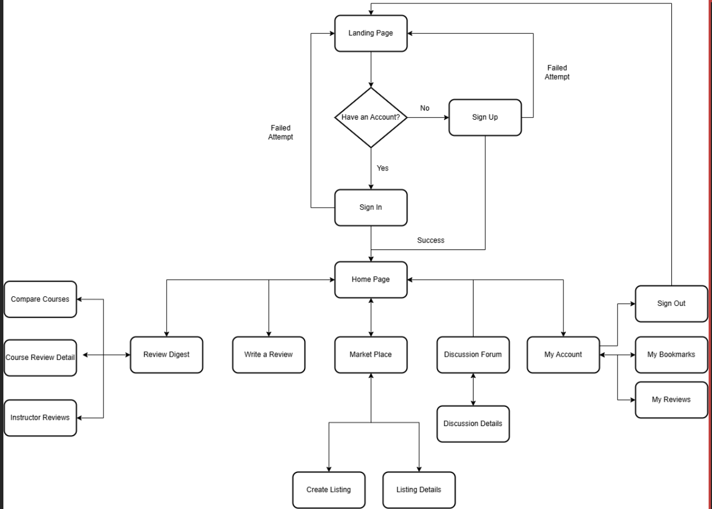
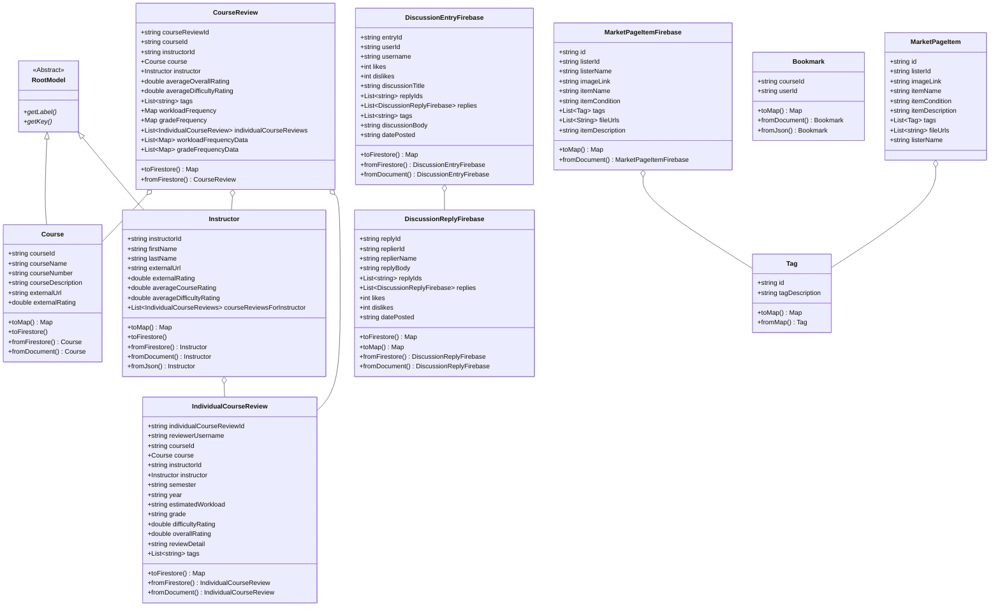
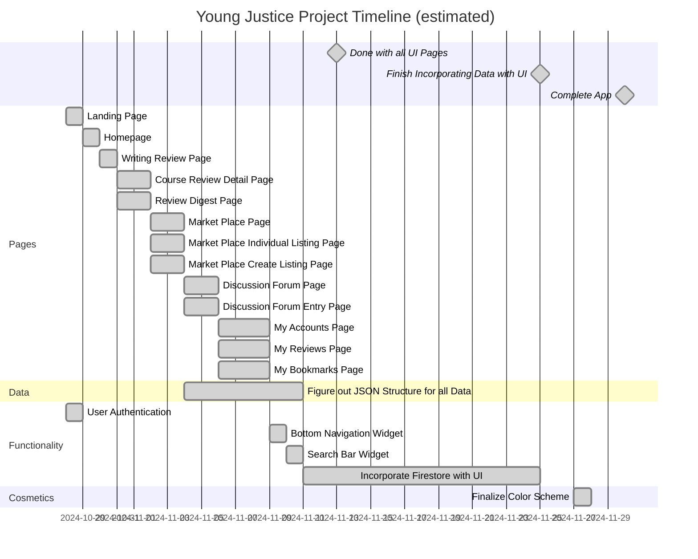

# Final Project - Young Justice
## Discourse: One Stop App for Anything Related to Course Review and Student Needs

## Software Requirements and Specifications
### Purpose
#### Background
Students, especially in their first year of enrollment, often find difficulties while looking for courses to enroll in. Even after receiving guidance from their academic advisors, sometimes there could be multiple sections of the same course with different instructors each with different teaching styles. Our proposed application deals with this problem, where students could browse for all available courses offered during the academic calendar and find reviews submitted by students who have taken the course in the past. The application will also provide the necessary metrics students could use to compare different courses and instructors to find the one that best suits their learning needs. Our platform will also provide a marketplace where students can buy, sell and exchange used course materials.

#### Definitions
Metrics: All information which describes how a course is carried out. This includes, but is not limited to the workload, lecture styles, workload formats, workload distribution across the semester, attendance policies, interaction with instructors, etc. 

Marketplace: A dedicated space where students can search for used course materials, with the intent to either buy or exchange them. Students can also list their used course materials within this space.  

Course Materials: Documents related to the course such as syllabus, textbooks and notes. Thorough verifications will be done to ensure no unauthorized materials such as exams and quizzes are published. 

### Overall Description
#### User Characteristics
- Age: 18-30 
- Gender: All genders 
- Main Focus: NEU undergraduate and graduate students seeking assistance with selecting courses, comparing instructors, and exchanging course materials. 

#### User Stories
User stories describe the functionality from the user's perspective. Here are some user stories for the NEU Class Navigator app: 

- As a student, I want to browse and view all available courses for the upcoming academic calendar. 
- As a student, I want to read reviews of courses written by students who have previously taken them. 
- As a student, I want to see metrics such as course workload, attendance policy, and instructor interaction. 
- As a student, I want to compare different course sections and instructors to choose the best fit for my learning style. 
- As a student, I want to post my reviews of courses and professors after completing them. 
- As a student, I want to be able to exchange used textbooks and course materials with other students. 
- As a student, I want to ensure that only authorized materials such as textbooks and notes are listed in the marketplace. 
- As a student, I want to interact with other students by posting questions and discussing courses through the app. 
- As a student, I want to be able to message other students privately to ask about course-specific concerns. 
- As a student, I want the app to pull in data from external platforms like RateMyProfessor to get comprehensive insights without visiting multiple sites. 
- As a student, I want my data and interactions within the app to be secure and private.

#### App Workflow

### Requirements
#### Functional Requirements (Critical Features are Listed as Bold): 
- **The app shall allow students to view detailed course data, such as workload, lecture styles, and attendance policies.** 
- **The app shall allow students to post reviews of courses and instructors after completing the course.**
- **The app shall display student reviews of courses, including pros and cons, workload descriptions, and overall ratings, etc.** 
- **The app shall provide a comparison tool for students to compare the difference between courses or instructors.** 
- **The app shall allow students to list their used course materials in the marketplace for sale or exchange.** 
- **The app shall allow students to search for used course materials in a dedicated marketplace.** 
- **The app shall allow students to post questions and participate in discussions about specific courses.**
- **The app shall allow students to save courses they prefer for future reference.**
- The app shall provide data from external platforms (e.g., RateMyProfessor) for additional insights on instructors to users. 
- The app shall allow students to update or delete their reviews and posts. 
- The app shall include an advanced search function for students to filter courses by metrics like workload, teaching style, and instructor. 
- The app shall provide a private messaging function for students to communicate about course-related concerns. 
- The app shall offer a feedback function for students to report biased reviews or inappropriate course materials. 

#### Non-Functional Requirements (Critical features are Listed as Bold)
- **The app shall be accessible to screen readers such as iOS’s VoiceOver or Android’s TalkBack**
- **The app shall secure the user data, including reviews and personal information.**
- **The app shall be reliable, with 99.9% uptime during peak enrollment periods.** 
- **The system shall support 50k active user authentication per month**  
- **The system shall be able to store at most 1GB of user data a month.** 
- **The system shall be able to support 20k document writes, 50k document reads, and 20k document deletes per day.** 
- **The app shall offer an interface for students while having minimal learning curves and being user-friendly.** 
- **The app shall use a responsive design to adapt different screen sizes and resolutions.** 
- The app shall run searches and comparisons within 2 seconds under normal load conditions.
- The app shall be regularly audited to ensure security compliance and data protection.
- The app shall have minimal downtime during updates or maintenance windows.

## Model Class Diagram

